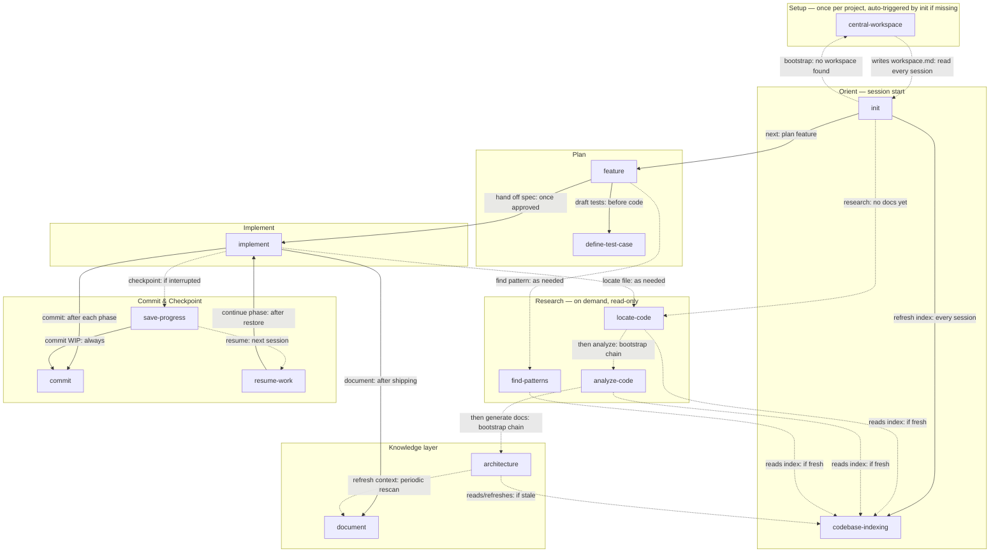

# Engineering Skills

> Portable AI skills for software engineering workflows — planning, implementing, documenting, and committing code.

A growing collection of plug-and-play skills for Claude Code, Cursor, GitHub Copilot, Windsurf, Cline, and OpenAI Codex. Each skill is a single markdown file — no dependencies, no frameworks, no lock-in. Just copy it in and go.

---

## Why this exists

AI tools are powerful. But the prompts behind them are usually scattered, duplicated, and written once then forgotten. These skills are built to be **reusable, portable, and consistent** — the same behavior whether you're on Claude Code today or Cursor tomorrow.

Every skill follows the same format:
- Pure imperative prose — no tool-specific syntax
- [agentskills.io](https://agentskills.io/specification)-compliant frontmatter (`name`, `description`, plus `phase`/`input`/`output`/`dependencies` under `metadata:`)
- Works standalone — paste into any AI tool and it runs

---

## Workflow

The skills below aren't independent utilities — they form one pipeline. This is the order they run in during a typical feature, and what each step hands to the next.

1. **Bootstrap once per project — or let `init` do it for you** — `central-workspace` scans existing prompts/paths and writes the single `workspace.md` every tool auto-loads. You can run it directly; you can also just start with `init` — it checks whether a workspace is already loaded and invokes `central-workspace` itself if not, before anything else happens. Re-run it manually when onboarding a new tool or after major path changes.
2. **Orient at session start** — `init` (workspace bootstrapped per Step 1) loads `docs_context`/`system.md`/`TODO.md` and, via `codebase-indexing`, ensures the code graph indexes are fresh (near-instant if already warm). If no docs exist yet, `init` falls back to `locate-code` → `analyze-code` → `architecture` to build them from scratch.
3. **Plan the feature** — `feature` researches the codebase (re-invoking `init` if context isn't loaded), designs options, and writes a spec — pulling in `define-test-case` to draft the spec's testing strategy as sequenced, seam-anchored test cases *before* any code exists.
4. **Implement phase by phase** — `implement` executes the approved spec, verifying and invoking `commit` after each phase. If interrupted mid-phase, `save-progress` checkpoints: a WIP commit (via `commit`) plus a numbered session file.
5. **Resume later** — `resume-work` rebuilds context from that session file and hands off to `implement` to continue from the first unchecked step.
6. **Document what shipped** — `document` analyzes the diff and writes a scoped doc to `core_docs_dir`, registering it in `doc_dictionary.md` so it surfaces automatically next time it's relevant.
7. **Refresh the big picture periodically** — unlike `document` (one feature's diff), `architecture` re-scans the whole repo on its own cadence, keeping `CONTEXT.md`/`system.md`/`service-manifest.md` from drifting as many features land over time.

`locate-code`, `analyze-code`, and `find-patterns` don't sit in this numbered flow — they're on-demand research helpers other skills reach for mid-step (e.g. `feature` finding an existing pattern to follow, `implement` locating a file). All three, plus `architecture`, read the graph that only `codebase-indexing` ever builds.



**Reading the diagram:** solid arrows are direct invocations (one skill hands off to another); dashed arrows are conditional or read-only relationships. `init` ↔ `central-workspace` is intentionally two-way — `init` conditionally invokes it to bootstrap the workspace, then reads back what it wrote — every other pair is one-directional. `codebase-indexing` is the only node with incoming "reads" edges from four different skills and no outgoing invocation of its own — it's a pure dependency, never a caller, by design (see its own README for the one-writer/many-readers rationale).

---

## Skills

### [central-workspace](central-workspace/)

> One workspace file. Every AI tool. Any project.

Stop hardcoding paths and copy-pasting rules across every skill file. `central-workspace` scans your existing prompts, extracts every hardcoded value, and wires them into a single `workspace.md` that every tool loads automatically. Run it directly, or just start with `init` — it invokes this skill automatically the first time it finds no workspace loaded.

**Solves:** scattered paths · duplicated security rules · new prompt sets overwriting your defaults · starting over every time you switch tools

```bash
npx skills add pdkproitf/skills@central-workspace
```

---

### [init](init/)

> Load project context before starting any task.

Reads docs, domain models, and active TODOs to build a complete mental model of the codebase. Bootstraps `central-workspace` automatically first if no workspace is loaded yet. Other skills invoke it automatically as a dependency.

```bash
npx skills add pdkproitf/skills@init
```

---

### [codebase-indexing](codebase-indexing/)

> The single writer for the codebase graph indexes — build once, refresh incrementally, never rebuild what's already fresh.

Builds and refreshes the two graph backends other skills read from: the `codebase-memory-mcp` structural index (symbols, call chains, data flow) and the `graphify` semantic graph (`LESSONS.md` — god nodes, communities, patterns, decisions). It's the only skill that triggers the expensive build operations; everything else (`locate-code`, `find-patterns`, `analyze-code`, `architecture`) is a read-only consumer that falls back to manual search immediately if the index isn't ready — no skill ever blocks on a cold build it didn't ask for.

```bash
npx skills add pdkproitf/skills@codebase-indexing
```

---

### [architecture](architecture/)

> Map the overall system architecture from a full codebase scan into a `docs_context` documentation layer.

Scans the codebase as a whole (not a diff) and writes a purpose-split `docs_context` layer — `docs_context` itself (default `.docs/CONTEXT.md`: business flows, journeys, concepts, owned capabilities), a `system.md` sibling (layers, data flow, domain models, invariants, file index, API surface, outbound dependencies, event contracts), and a `service-manifest.md` — a portable, agent-ready registry entry (projected from `system.md`, never hand-authored) that a multi-repo orchestrator can aggregate without re-scanning any code. Re-running it reconciles rather than rewrites, so it stays accurate as the system evolves.

```bash
npx skills add pdkproitf/skills@architecture
```

---

### [analyze-code](analyze-code/)

> Trace how a feature or component actually works — data flow, logic, and dependencies with file paths and line numbers.

Deep-reads a target file, class, or feature and produces a structured analysis: entry points, core logic flow, key methods, data flow, dependencies, and error handling.

```bash
npx skills add pdkproitf/skills@analyze-code
```

---

### [find-patterns](find-patterns/)

> Find copy-ready examples and conventions in the codebase before building something new.

Searches for existing implementations, extracts complete working snippets, and documents naming conventions, file organization, and testing patterns in use.

```bash
npx skills add pdkproitf/skills@find-patterns
```

---

### [locate-code](locate-code/)

> Find WHERE code lives for a feature or topic — fast, without reading file contents.

Returns file paths grouped by layer (implementation, tests, config, entry points) so you can orient quickly before diving deeper.

```bash
npx skills add pdkproitf/skills@locate-code
```

---

### [feature](feature/)

> Research the codebase, design options, and write a structured implementation plan ready to execute.

Produces a complete spec file in `docs/specs/` covering design options, phased tasks, testing strategy (via `define-test-case`), and acceptance criteria.

```bash
npx skills add pdkproitf/skills@feature
```

---

### [implement](implement/)

> Execute an approved spec — phase by phase, with verification and commits after each phase.

Reads a spec from `feature`, implements it step by step, updates checkboxes, runs validation commands, and commits each completed phase via `commit`.

```bash
npx skills add pdkproitf/skills@implement
```

---

### [define-test-case](define-test-case/)

> Define acceptance test cases in DSL format — comment-first, covering happy paths, edge cases, errors, and authorization.

Generates structured test case definitions using your project's existing DSL conventions, before any implementation begins.

```bash
npx skills add pdkproitf/skills@define-test-case
```

---

### [save-progress](save-progress/)

> Checkpoint your work — commit WIP, update the plan, and write a session summary you can resume from later.

Creates a complete handoff artifact: a WIP commit, an updated spec with progress notes, and a numbered session file in `docs/sessions/`.

```bash
npx skills add pdkproitf/skills@save-progress
```

---

### [resume-work](resume-work/)

> Restore a saved session and continue implementation from the last checkpoint.

Re-reads the session file, plan, research doc, and recent git history to rebuild full context, then picks up from the first unchecked step.

```bash
npx skills add pdkproitf/skills@resume-work
```

---

### [commit](commit/)

> Group changed files by logical concern and generate a Conventional Commits message for each group.

Analyzes git diff, groups changes by logical concern, and produces correctly formatted commit messages. Executes commits after confirmation if asked.

```bash
npx skills add pdkproitf/skills@commit
```

---

### [document](document/)

> Generate feature documentation from code changes and specs — creates a markdown doc and registers it in the conditional context index.

Analyzes `git diff origin/main`, writes structured docs to `docs/core/`, and updates `doc_dictionary.md` so docs surface automatically when relevant.

```bash
npx skills add pdkproitf/skills@document
```

---

## Install skills

Install all skills at once:

```bash
npx skills add pdkproitf/skills --all
```

Install a specific skill:
```bash
npx skills add pdkproitf/skills@<skill-name>
```

For global installation (all projects):
```bash
npx skills add pdkproitf/skills --global
```

---

## Skill format

Every skill follows the [agentskills.io](https://agentskills.io/specification) format — only `name`, `description`, and (optionally) `license`/`compatibility`/`metadata`/`allowed-tools` are valid at the top level. Anything specific to this repo's workflow (`phase`, `input`, `output`, `dependencies`) lives under `metadata:` as strings, so the file stays spec-valid while still carrying that information:

```markdown
---
name: skill-name
description: one line — what this skill does and when to use it
metadata:
  phase: "orient | plan | test | implement | commit | checkpoint | document | setup"
  input: "what the caller passes in"
  output: "what this skill produces"
  dependencies: "other skills or tools this one invokes or reads, if any"
---

# skill-name

## Step 1 — ...
## Step 2 — ...
```

`name` must match its parent directory, lowercase with hyphens only. No `$ARGUMENTS`. No tool names. No slash command cross-references. Just instructions any AI can follow.

---

## Contributing

Skills should be:
- **Self-contained** — no external dependencies or imports
- **Tool-agnostic** — no Claude-specific syntax, tool names, or slash commands
- **Focused** — one clear job, one clear output
- **Idempotent** — safe to run more than once

Open a PR with your skill in `skills/engineers/{your-skill-name}/` alongside a `README.md`. The skill file (`.md`) and metadata are all that's needed — npx skills handles installation for all tools.
